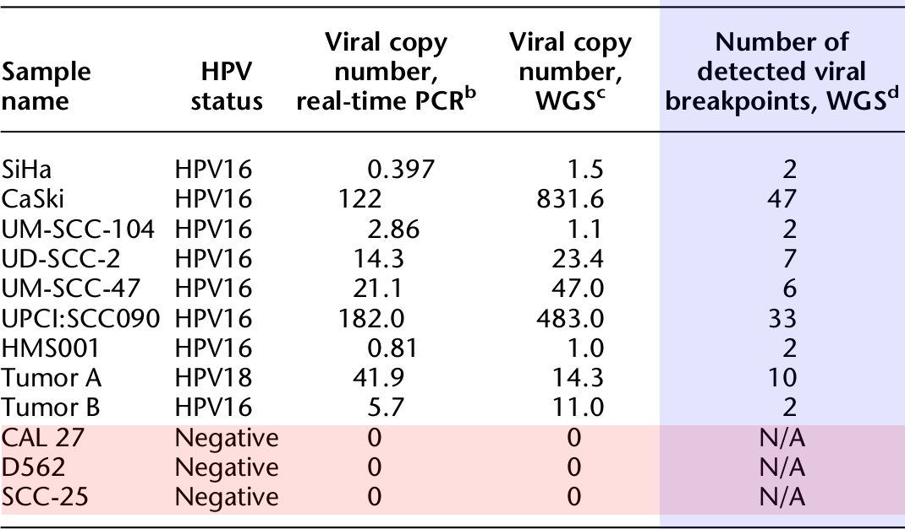
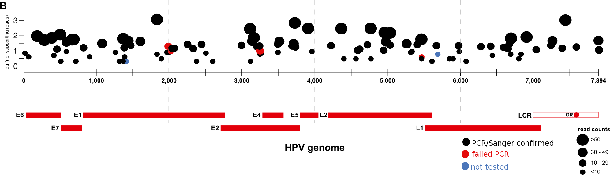
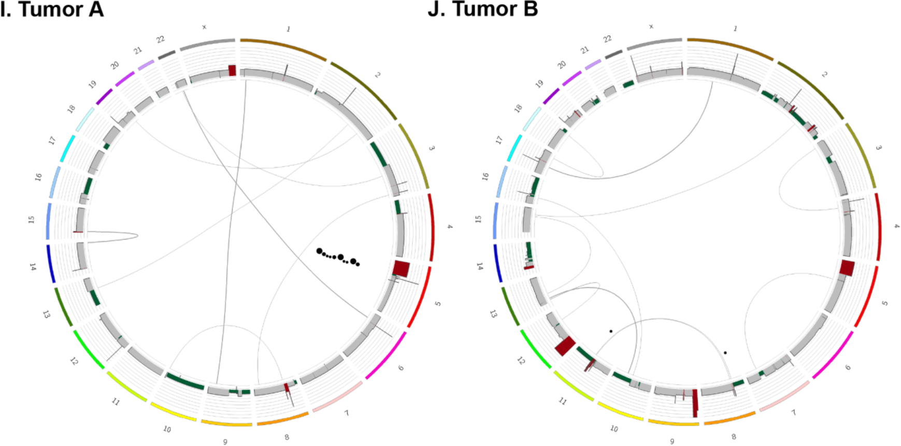

## DNA tumor viruses
* Kaposi's sarcoma-associated herpesvirus
* Epstein-Barr virus (lymphomas and others)
* Human cytomegalovirus (mucoepidermoid carcinoma)
* Merkel cell polyomavirus
* Human papilloma virus

--- &twocol_shower

## Human papillomavirus (HPV)

*** left

*  > 40 strains of HPV
  * HPV 16 and 18 most carcinogenic
* Cause of nearly all cervical, as well as other anogenital and H&N, cancers
* > 600K cases worldwide
* Generally sexually transmitted
* Detected on other body surfaces as well
* Two vaccines available since 2006

[Am. Jour. Ob/Gyn. 208:3, Mar 2013](http://dx.doi.org/10.1016/j.ajog.2012.09.007)

*** right


--- &slide_center

## 


```{r echo=FALSE, warning=FALSE, message=FALSE}
# HPV infects keratinocytes in basal layer of epithelium
# Virus replicates as episomal elements during normal life cycle of keratinocytes
# Infected keratinocytes do not undergo terminal differentiation
# Integration into host genome increases with severity
# Oncoproteins
# E6 <-> p53 (downregulates apoptosis pathway genes)
# E7 <-> RB1 (disrupts G1/S phase transition of cell cycle)
# HPV E2 gene often disrupted in integrated viral sequence, loss blocks induction of apoptosis by lack of inhibition of E6, E7
```

---

## HPV integration and structural abnormalities

### Host structural variation in region of integration observed in 30-40% of cervical carcinomas, but this is based on (relatively) low resolution SNP arrays.

---

<center>

</center>

---

## Table 1


---

## Table 1


Nearly 40x WGS coverage in all samples!

---

## Table 1



---

## Variability in HPV genomes and transcriptomes (Fig. 1A)


```{r}
```

---

## Breakpoints in HPV genome (Fig. 1B)

111 total breakpoints; E2 lost in 4 samples, E6 and E7 retained in all samples



```{r}
## Unappreciated view of intraviral rearrangements
```

---

## Supp Fig 1A, 5A


---

## Supp Fig 1B, 5B


---

## Supp Fig 1C, 5C


---

## Supp Fig 1I, 1J, 5I, 5J



---

## HPV and the cellular genome (Supp. Fig. 3)


---

## Focal clustering of HPV integrants (Fig. 2)


--- &twocol_shower

## HPV insertions flank copy number variations

*** left

The authors noted that the number of breakpoints was less than viral CN.

Thus, they hypothesize that amplification of viral integrants and flanking genomic sequence lead to redundant, identical breakpoints.

*** right


---

## WGS of HPV integrations (Fig. 3 A, C)


---

## WGS of HPV integrations (Fig 3 E, F)


---

## What is the detailed structure of the focal rearrangements involving HPV integration?

### Using the breakpoints and CNVs identified through WGS, build connectivity maps.

---

## SiHa cells (Figure 4A)


Two breakpoints flank 2x amplified 300-kb segment, 2' rearrangement of a 72kb deletion

---

## HMS001 cells (Fig. 4B)


Two breakpoints delineated an HPV16 integrant that spanned a small genomic deletion

--- 

## Complex integration & CNV rearrangements (Fig. 5)


---

## Evaluation of primary tumors (Fig. 6A-C)


---

## Evaluation of primary tumors (Fig. 6D-E)


---

## What kind of model explains these linear genome structures?

### The authors hypothesize a "looping" model with rolling circle type amplification (Figure 4C)

---

## Looping model of Your Favorite Gene (Fig. 4C)


---

## Summary thus far

1. Confirmation that HPV integrations flank host genome CNVs (high resolution)

2. Observed in cell lines, tumor samples

3. Explained patterns of breakpoints by RCA-type looping model

4. Half of another 21 HPV+ primary tumors have same pattern

---

## What other carcinogenic mechanisms could HPV be involved in?

---

## HPV integrants disrupt cellular genes

1. Overall, a statistically NON-significant signature of enrichment near RefSeq genes, fragile sites, or DNaseI sensitive sites

2. The RNAseq data confirmed the WGS data (same genomic rearrangements)

3. Identified viral-host gene fusions in all cell lines and Tumor A

---

## Disruption of genes (Fig. 7A, 3D)


5' end of transcript not expressed, while truncated 3' transcripts have higher expression

---

## Disruption of genes (Fig. 7B)


Viral fused truncated 3' transcripts

```{r}
## deletion and rearrangement of DIAPH2 locus, which plasy a role in sister-chromatid separation
## resulted in alt spiced viral host fusion genes
## viralhost fusion transcripts of DIAPH2 were expressed while the native transcripts was not
```

---

## Disruption of genes (Fig. 7C-E)


---

## Amplification leads to aberrant expression of TP63 (Fig 7F, 3C)


---

## Amplification leads to aberrant expression of TP63 (Fig 7G)


```{r}
## novel viral-host fusion transcripts expressed, and a novel 25kDa protein

## Skipping another example of amplification of FOXE1, PIM1
## Also skipping an example of gene breakage, describes a mechanism where a disrupting event in a gene region results in two separate transcripts
## In this case, premature termination of txpts at the HPV5 polyA site was the suspected cause of gene breaking at a solute carrier gene SLC47A2
```

---

## Summary

A 'novel' application of HT sequencing for high resolution picture of HPV integration and it's ties to genome instability (an important feature of cancers).

Find evidence of more frequent association of HPV integration and CNVs.

Hypothesis of the 'looping model' supported by the WGS and RNAseq data.

Rule out some other mechanisms, such as chromothripsis

---

## Chromothripsis in neuroblastoma


---

## Chromothripsis in neuroblastoma


---

## Drawbacks

Use of cultured cells; though have also tested some tumors (and more on the way)

Repetitive regions are difficult to study, WGS is not the end solution

Li et al. (J Clin Virol 2013) find preferential sites for integration in repetitive regions

Schmitz et al. (PloS one 2012) find homology between HPV sequence, nearby integration site sequence

No mention of HPV tandem repeats (observed in CaSki)

---

## Thanks for watching!

<center>

</center>

