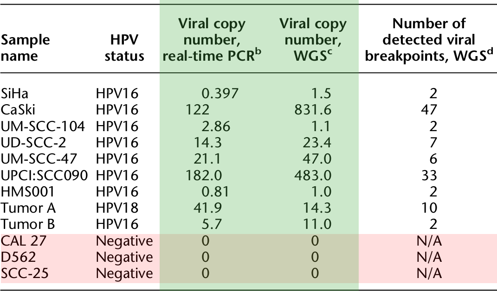

## DNA tumor viruses
* Kaposi's sarcoma-associated herpesvirus
* Epstein-Barr virus (lymphomas and others)
* Human cytomegalovirus (mucoepidermoid carcinoma)
* Merkel cell polyomavirus
* Human papilloma virus

--- &twocol_shower

## Human papillomavirus (HPV)

*** left

*  > 40 strains of HPV
  * HPV 16 and 18 most carcinogenic
* Cause of nearly all cervical, as well as other anogenital and H&N, cancers
* > 600K cases worldwide
* Generally sexually transmitted
* Detected on other body surfaces as well
* Two vaccines available since 2006

http://dx.doi.org/10.1016/j.ajog.2012.09.007

*** right


--- &slide_center

## 


```{r echo=FALSE, warning=FALSE, message=FALSE}
# HPV infects keratinocytes in basal layer of epithelium
# Virus replicates as episomal elements during normal life cycle of keratinocytes
# Infected keratinocytes do not undergo terminal differentiation
# Integration into host genome increases with severity
# Oncoproteins
# E6 <-> p53 (downregulates apoptosis pathway genes)
# E7 <-> RB1 (disrupts G1/S phase transition of cell cycle)
# HPV E2 gene often disrupted in integrated viral sequence, loss blocks induction of apoptosis
```

---

## HPV integration and structural abnormalities

Host structural variation in region of integration observed in 30-40% of cervical carcinomas, but this is based on (relatively) low resolution SNP arrays.

---

## HPV integration and structural abnormalities

* Host structural variation in region of integration
  * ~40% of cervical carcinomas

---

<center>

</center>

---


Nearly 40x WGS coverage in all samples.

---



---


---

## Detecting HPV integration by whole genome sequencing (Fig. 1A)


```{r}
## clonal relationship b/c of unique homozygous viral mutations
## Variable coverage indicates breakpoints/rearrangements
## Unique breakpoints, rearrangements
## E6/E7 oncogenes retained
## RNASeq positive for HPV viral genes (supp fig 2)
```

---

## Breakpoints in HPV genome (Fig 1B)

111 total breakpoints; E2 lost in 4 samples, E6 and E7 retained in all samples


```{r}
## Unappreciated view of intraviral rearrangements
```

---

## Supp Fig 1a

---

## Supp Fig 1b

---

## Supp Fig 1c

---

## Supp Fig 1i-j

---

## Variation in the host genome (Supp Fig 3)

Comparison of mutational spectra in HPV-positive vs. HPV-negative cancer samples.

---

## Focal, non-recurrent HPV integration clusters (Figure 2)

HPV integrants cluster in focal regions within samples, but uniquely throughout the genome between samples

```{r}
## specific, chromosomal regions in different cell lines
## confirmed with FISH and SKY
## Confirmed most except low copy number
## HPV FISH signals found in identical cytogenetic regions of duplicate chromosomal copies, but with variable intensities
## suggests integration preceded chrom duplic and subsequent divergence in viral copy number. 
## 6/9 
```

---

## HPV insertions flank CNVs

Is there a relationship between HPV integration and host genome CNVs?

```{r}
## breakpoints less numerous than viral CN
## Hypothesized due to amplification of viral integrants and flanking genomic sequence -> redundant identical BPs
## observe focal genomic CNVs in 8/9 HPV-positive cases
## found at amplfications ranging from 1.5x (HMS001) to 58x (UPCI:SCC90) increase
## also occurred near deletions from 487bp (HMS001) to 234kb (UPCI:SC0090)
## All confirmed by qPCR, PCR, Sanger seq
```

---

## What is the detailed structure of the focal rearrangements involving HPV integration?

---

```{r}
## Used the breakpoints and CNVs identified through WGS to build connectivity maps
## Confirmed with targeted PCR, Sanger sequencing and chromosomal walking
```

---

## SiHa cells (Figure 4A)

```{r}
## Two insertional breakpoints flank a 2x amplified 300kb segment with an internal 72kb deletion
## ends up with a concatemerized head-to-tail genomic/HPV segments (two HPV integrants bounded by identical breakpoints)
```

---

## HMS001 cells (Figure 4B)

```{r}
## two HPV insertional breakpoints spannind a small deletion
## Adjacent host genome frgas and HPV seqs duplicated in tandem - results in two identical HPV integrants with an intrachromosomal rearrangement
```

--- 

## More complex integration + CNV rearrangements

Figure 5

```{r}
## resolved complex linear rearrangements in all but one HPV-positive cell lines
```

---

## What kind of model explains these linear genome structures? The authors hypothesize a "looping" model.

---

## General looping model with rolling circle amplification

Figure 4C

```{r}
## HPV integrants bridge non-contiguous genomic sequence by connecting nicked sites
## Then, the replication of a transient circularized genomic segment would result in focal amp of breakpoints involving HPV and flanking host genomic sequences
## Then, distal free ends of amplified strands could recombine with non-contiguous sequences and undergo DNA repair
## This would result in concatemerized linear structures bounded by recurrent, identical breakpoints

## RC replication has been observed in HPV (extracts from human epithelial cells induce rolling circle replication of the HPV16 origin-containing plasmid in vitro - http://onlinelibrary.wiley.com/doi/10.1111/j.1365-2443.2010.01458.x/full)
```

---

## Evaluation of primary tumors

Figure 6a-c

---

## Evaluation of primary tumors

Figure 6d-e

---

## Summary thus far

* HPV integrations flank host genome CNVs
* Explained patterns of breakpoints by RCA-type looping model
* Observed in cell lines, tumor samples
* Half of another 21 HPV+ primary tumors have same pattern

---

## What other carcinogenic mechanisms could HPV be involved in?

---

## HPV integrants disrupt cellular genes

* Overall a statistically non-significant signature of enrichment near RefSeq genes, fragile sites, or DNaseI sensitive sites
* The RNAseq data confirmed the WGS data (same genomic rearrangements)
* Identified viral-host gene fusions in all cell lines and Tumor A

---

## Disruption of genes involved in carcinogenesis (Fig 7)

```{r}
## deletion and rearrangement of DIAPH2 locus, which plasy a role in sister-chromatid separation
## resulted in alt spiced viral host fusion genes
## viralhost fusion transcripts of DIAPH2 were expressed while the native transcripts was not
```

---

## Amplification leads to aberrant expression of TP63 (Fig 7)

```{r}
## novel viral-host fusion transcripts expressed, and a novel 25kDa protein
```

---

## Amplification of genes in region of HPV breakpoints (Supp Fig 10)

---

## Gene breakage (Supp Fig 10)

```{r}
## gene breakage describes a mechanism where a disrupting event in a gene region results in two separate transcripts
## In this case, premature termination of txpts at the HPV5 polyA site was the suspected cause
```

---

## Discussion

---

## Other possibilities not mentioned or cited

* Li et al. (J Clin Virol 2013) find preferential sites for integration in repetitive regions
* Schmitz et al. (PloS one 2012) find homology between HPV sequence, nearby integration site sequence

```{r}
## No mention of 'tandem repeats', or head-to-tail concatemers, of HPV, which have previously been reported
## Including in the cell line CaSki, which is reported to have 500 tandem repeats of HPV16!
## rolling circle amp is probably not good for HPV; herpes viruses use it but have viral encoded cleavage protein, which papillomaviruses lack
## Some suggestion that DNA damage to HPV could lead to accidental RCA followed by integration via host DS-break repair mechanisms
```
