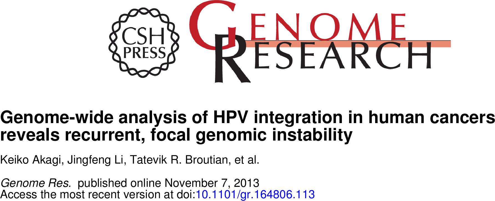

## HPV integration and structural abnormalities

* HPV E2 gene often disrupted in integrated viral sequence
  * loss blocks induction of apoptosis
* Host structural variation in region of integration
  * ~40% of cervical carcinomas

<center>

</center>

---

## 


---

## HPV WGS (Fig. 1A)


```{r echo=FALSE, warning=FALSE, message=FALSE}
# 2x100bp PE whole genome sequencing
# signif reads aligned to HPV in V+ samples
```

---

```{r echo=FALSE, warning=FALSE, message=FALSE}
library(ggplot2)
library(xtable)
library(plyr)

options(xtable.type="html", xtable.caption.placement="top")

```

## HPV integration breakpoints (Fig. 1B)


---

## 


---

## 


---

## 


---

## 


---

## 


---

## 


---

## 


---

## 


--- &twocol_shower

## Next Slide

*** left

### Stuff on the left:
Some stuff

*** right

### Stuff on the right:
> Some more stuff.

